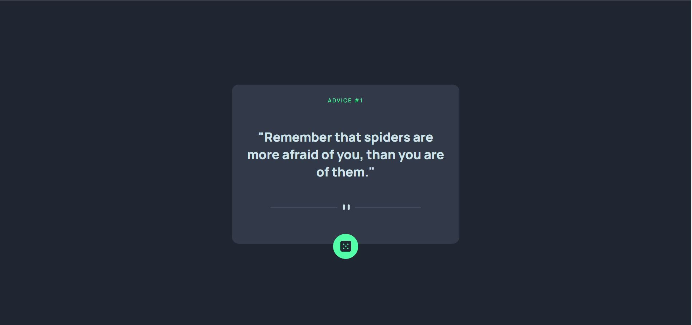

# Frontend Mentor - Advice generator app solution

This is a solution to the [Advice generator app challenge on Frontend Mentor](https://www.frontendmentor.io/challenges/advice-generator-app-QdUG-13db). Frontend Mentor challenges help you improve your coding skills by building realistic projects.

## Table of contents

- [Overview](#overview)
  - [The challenge](#the-challenge)
  - [Screenshot](#screenshot)
  - [Links](#links)
- [My process](#my-process)
  - [Built with](#built-with)
  - [Useful resources](#useful-resources)
- [Author](#author)

## Overview

### The challenge

Users should be able to:

- View the optimal layout for the app depending on their device's screen size
- See hover states for all interactive elements on the page
- Generate a new piece of advice by clicking the dice icon

### Screenshot

### Links

- Solution URL: [Gihub](https://github.com/elienensousa/Advice-Generator-App)
- Live Site URL: [Advice Generator App](https://advice-generator-app-plum-eight.vercel.app/)

## My process

### Built with

- Semantic HTML5 markup
- CSS custom properties
- Flexbox
- Mobile-first workflow
- [React](https://reactjs.org/) - JS library
- [SCSS](https://sass-lang.com/) - For styles

### Useful resources

- [Como fazer o fetch dos dados em React](https://www.freecodecamp.org/portuguese/news/como-fazer-o-fetch-dos-dados-em-react/)
- [Modern API data-fetching methods in React](https://blog.logrocket.com/modern-api-data-fetching-methods-react/) - This is an amazing article which helped me finally understand XYZ. I'd recommend it to anyone still learning this concept.

## Author

- Frontend Mentor - [@elienensousa](https://www.frontendmentor.io/profile/elienensousa)

